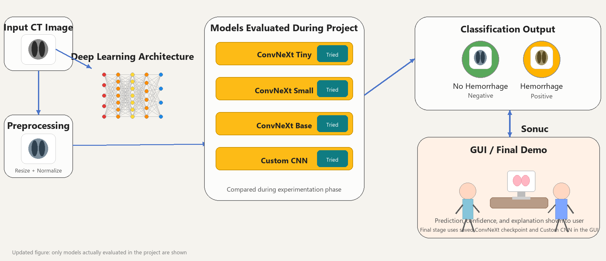
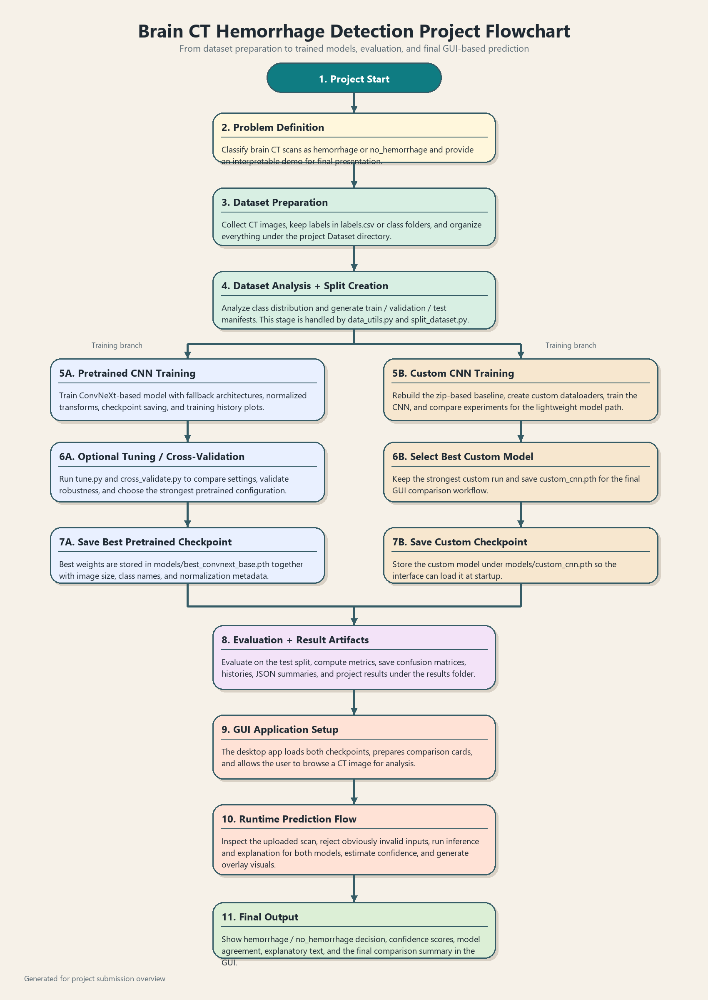

# Brain Hemorrhage Detection

Brain Hemorrhage Detection is a Python deep learning project for classifying brain CT images as `hemorrhage` or `no_hemorrhage`. The repository includes training, evaluation, checkpoint export, command-line prediction, and a Tkinter GUI for comparing a pretrained ConvNeXt-based model with a custom CNN.

> This project is for educational and research use only. It is not a medical device and must not be used as the sole basis for diagnosis or treatment.

## Features

- Brain CT image classification with PyTorch and torchvision.
- GUI workflow for selecting a scan, comparing two models, viewing probabilities, and showing a localized focus preview.
- CLI prediction script for single-image inference.
- Training and evaluation scripts for pretrained CNNs and custom CNN experiments.
- Saved metrics, confusion matrices, and training curves for reproducibility.

## Project Preview





## Repository Structure

```text
BrainHemorrhage/
  models/
    best_convnext_base_es_uint8.pth   # GitHub-safe pretrained checkpoint used by the GUI
    custom_cnn.pth                    # Custom CNN checkpoint used by the GUI
  results/
    project_summary/                  # Summary figures for README/project report
    */                                # Evaluation metrics, curves, and confusion matrices
  src/
    gui_app.py                        # Desktop GUI
    predict.py                        # Single-image CLI inference
    train.py                          # Pretrained model training
    train_custom_from_zip.py          # Custom CNN training
    evaluate.py                       # Evaluation pipeline
    model_utils.py                    # Models, inference, metrics, visualization helpers
    data_utils.py                     # Dataset preparation helpers
  requirements.txt
```

Large alternative checkpoints above GitHub's 100 MB file limit are intentionally ignored by `.gitignore`. The runnable GUI checkpoints are kept under `models/`.

## Setup

Use Python 3.10 or newer.

```powershell
python -m venv .venv
.\.venv\Scripts\Activate.ps1
python -m pip install --upgrade pip
pip install -r requirements.txt
```

If PyTorch installation fails or you need GPU-specific wheels, install PyTorch from the official selector first, then run `pip install -r requirements.txt`.

## Run the GUI

```powershell
python src\gui_app.py
```

The GUI loads:

- `models/best_convnext_base_es_uint8.pth`
- `models/custom_cnn.pth`

Click **Browse** to select a brain CT image, then click **Compare** to run both models.

## Single Image Prediction

```powershell
python src\predict.py path\to\ct_image.png
```

Use a custom checkpoint:

```powershell
python src\predict.py path\to\ct_image.png --checkpoint models\custom_cnn.pth
```

## Training

Expected dataset location for the default scripts:

```text
Dataset/
  labels.csv
  head_ct/
    head_ct/
      001.png
      ...
```

Train a pretrained model:

```powershell
python src\train.py --dataset-root Dataset --model convnext_tiny --run-name convnext_tiny_es
```

Train the custom CNN:

```powershell
python src\train_custom_from_zip.py --dataset-root Dataset
```

Evaluate a checkpoint:

```powershell
python src\evaluate.py --checkpoint models\best_convnext_base_es_uint8.pth
```

## Reported Test Metrics

Current saved metrics:

| Model | Accuracy | Precision | Recall | F1 |
| --- | ---: | ---: | ---: | ---: |
| ConvNeXt Base ES / uint8 checkpoint | 0.95 | 0.9545 | 0.95 | 0.9499 |
| Custom CNN | 0.90 | 0.9167 | 0.90 | 0.8990 |

See `results/` for training curves, confusion matrices, and JSON metric files.

## Push to GitHub

After reviewing the files:

```powershell
git init
git add .
git commit -m "Initial brain hemorrhage detection project"
git branch -M main
git remote add origin https://github.com/<your-username>/Brain-Hemorrhage.git
git push -u origin main
```

Replace `<your-username>` with your GitHub username.
